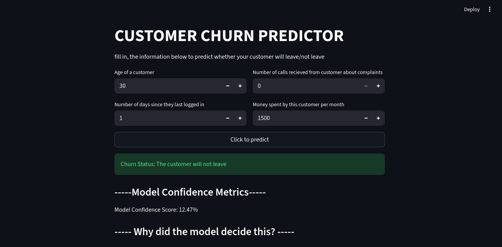
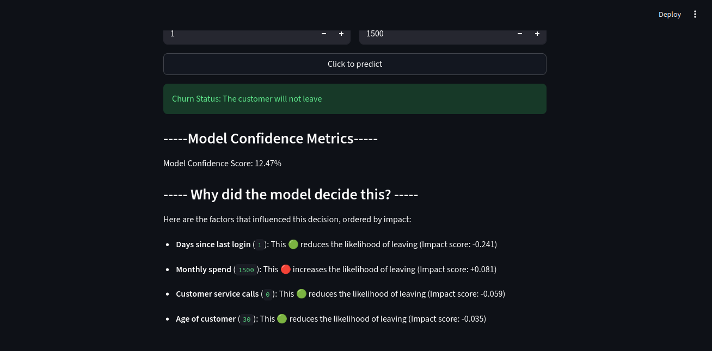
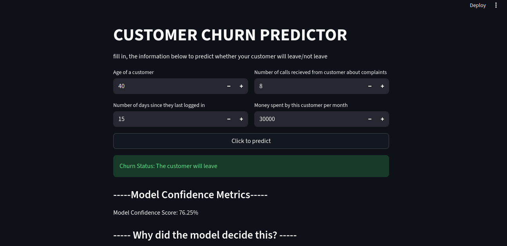
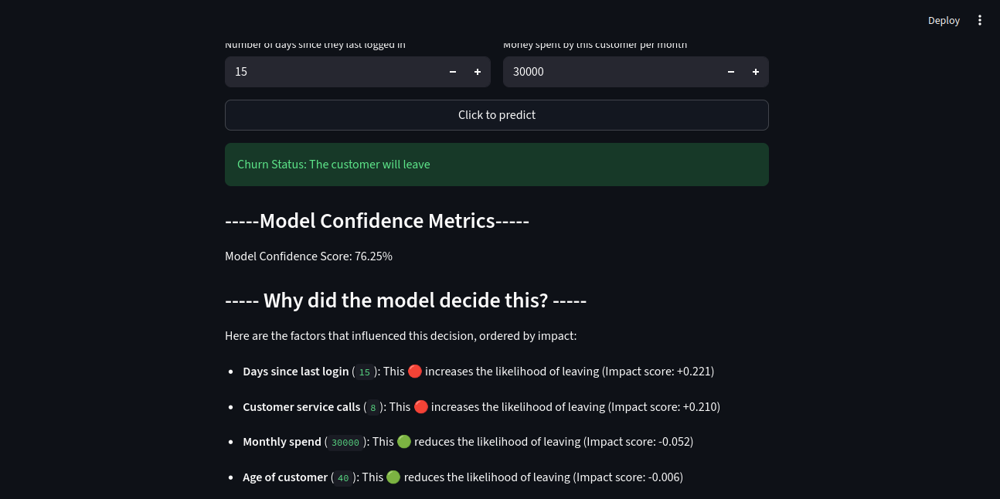

# Customer Churn Prediction System

An end-to-end **Machine Learning Engineering project** for predicting the risk of loosing customers.

This project goes beyond training a machine learning model. It covers the complete journey from data extraction and model development to API serving, containerization, cloud deployment, and a user-facing frontend.

## 🚀 Project Overview

The system predicts the risk/status of a customer leaving the platform using customer related information.

The target variable is `Customer_Churn`, mapped as:

- `Staying` → `0`
- `Leaving` → `1`


The project was built with a focus on practical **ML Engineering**, including reproducible preprocessing, model selection, validation, deployment, and serving predictions through an API.

---

## 🏗️ Architecture

```text
PostgreSQL
    │
    ▼
Data Extraction
    │
    ▼
Data Preprocessing
    │
    ├── Numerical Features
    │      └── StandardScaler
    │
    └── Categorical Features
           └── OneHotEncoder
    │
    ▼
RandomForest Classifier
    │
    ▼
Model Evaluation
    │
    ▼
Joblib Model Persistence
    │
    ▼
FastAPI
    │
    ▼
Docker
    │
    ▼
Cloud Deployment
    │
    ▼
Streamlit Frontend
    │
    ▼
User Prediction
```

---

# 🧠 Machine Learning Pipeline

## 1. Data Source

The dataset is retrieved from a PostgreSQL database using SQLAlchemy.

The model uses Age, Logging-status, Monthly-expenditure, Service-calls, and customer-related information.

### Features used during training

- `Age`
- `Days_Since_Last_Login`
- `Customer_Service_Calls`
- `Monthly_Spend`

The training process retrieves up to 10,000 rows.

---

## 2. Train/Test Split

The data is split into:

- **80% training**
- **20% testing**

with stratification and `random_state=24`.

The training portion is further split into:

- Model training data
- Validation data

using an 80/20 split with `random_state=42`.

---

# ⚖️ Class Imbalance

Because the target classes are not perfectly balanced, balanced sample weights were calculated using:

```python
compute_sample_weight(
    class_weight="balanced",
    y=y_train_model
)
```

This helps the model pay more attention to minority classes.

---

# ⚙️ Preprocessing

A `ColumnTransformer` is used to process numerical and categorical features separately.

### Categorical features

Categorical columns are encoded using:

```python
OneHotEncoder(handle_unknown="ignore")
```

This makes the model safer when it encounters categories that were not present during training.

### Numerical features

Numerical columns are scaled using:

```python
StandardScaler()
```

---

# 🤖 Model

The primary model used is:

```python
RandomForestClassifier()
```
Did some threshold analysis in order to balance the metrics and chose 0.45 where the confusion matrix seemed to be balanced

The model and threshold are placed inside a Scikit-learn `Pipeline` together with the preprocessing stage.

This is important because preprocessing and prediction are packaged together rather than being treated as separate manual steps.

---

# 🔍 Model Selection

Several machine learning algorithms were compared, including:

- Random Forest
- Logistic Regression
- Decision Tree


Random Forest produced the strongest overall performance on the unseen test set among the models evaluated.

---

# 🎯 Hyperparameter Tuning

`GridSearchCV` was used to search for better XGBoost parameters.

Parameters searched:

```python
n_estimators:
    200
    300
    500

max_depth:
    3
    5
    7
    None
```

The search used:

- 5-fold cross-validation
- Macro Recall as the scoring metric
- `n_jobs=-1`

### Best parameters

```text
n_estimators = 500
max_depth = None
```

### Best cross-validation recall

```text
0.8467341957182913
```

---

# 📊 Model Performance

## Validation Performance

Before final evaluation, the model achieved:

| Metric | Score |
|---|---:|
| Accuracy | 0.7460 |
| Precision | 0.7853 |
| Recall | 0.9181 |
| F1 Score | 0.8465 |
| ROC-AUC | 0.6596 |

### Validation classification report

| Class | Precision | Recall | F1 |
|---|---:|---:|---:|
| Staying (0) | 0.42 | 0.19 | 0.26 |
| Leaving (1) | 0.79 | 0.92 | 0.85 |


---

# 🧪 Unseen Test Performance

The final model was evaluated on a completely unseen test set.

| Metric | Score |
|---|---:|
| Accuracy | 0.7284 |
| Precision | 0.8080 |
| Recall | 0.8448 |
| F1 Score | 0.8260 |
| ROC-AUC  | 0.6780 |

The model maintained a strong ROC-AUC score while achieving relatively high recall, which is particularly useful when the minority classes matter.

---

# 🔬 Feature Importance

The most influential features included:

| Feature | Importance |
|---|---:|
| Days_Since_Last_Login | 0.379962 |
| Monthly_Spend | 0.315121 |
| Repayment Status — On-Time | 0.129577 |
| Age | 0.201341 |
| Customer_Service_Calls | 0.103577 |


# Thresholds


| Threshold | Precision  |  Recall | F1 Score |
|---|---:|

|0       |0.10|   |0.763435|  |0.999310|  |0.865591|
|1       |0.15|   |0.765484|  |0.997241|  |0.866128|
|2       |0.20|   |0.769642|  |0.993103|  |0.867209|
|3       |0.25|   |0.774770|  |0.986897|  |0.868062|
|4       |0.30|   |0.781042|  |0.971724|  |0.866011|
|5       |0.35|   |0.786644|  |0.958621|  |0.864159|
|6       |0.40|   |0.789936|  |0.931034|  |0.854701|
|7       |0.45|   |0.803472|  |0.893793|  |0.846229|
|8       |0.50|   |0.808047|  |0.844828|  |0.826028|
|9       |0.55|   |0.815638|  |0.784138|  |0.799578|
|10      |0.60|   |0.825847|  |0.722759|  |0.770872|
|11      |0.65|   |0.840868|  |0.641379|  |0.727700|
|12      |0.70|   |0.856405|  |0.571724|  |0.685691|
|13      |0.75|   |0.869077|  |0.480690|  |0.619005|
|14      |0.80|   |0.868852|  |0.402069|  |0.549741|
|15      |0.85|   |0.884314|  |0.311034|  |0.460204|
|16      |0.90|   |0.915361|  |0.201379|  |0.330130|

The results show that Age, days since last login, repayment status, monthly spend, and customer service calls were among the strongest contributors to the model's predictions.

---

# 💾 Model Persistence

After training and evaluation, the final model was saved using Joblib:

```text
CustomerChurn.pkl
```

The model is loaded by the API using:

```python
model = joblib.load("Model/CustomerChurn.pkl")
```

This allows the trained model to be reused without retraining every time the API starts.

---

# 🌐 FastAPI

The trained model is exposed through a FastAPI application.

The API accepts customer information and returns a prediction and probability.

## Input validation

Pydantic is used to validate incoming requests.

Examples of validation include:

```python
Age >= 18

Monthly_Spend >= 0

Customer_service_calls >= 0

days_since_last_login >= 0
```

---

# 🐳 Docker

The API is containerized using Docker.

The Docker image uses:

```text
python:3.13-slim
```

The container installs the required runtime dependencies and exposes port `8000`.

The container starts the FastAPI application with Uvicorn.

The application also supports the cloud-provided `PORT` environment variable.

---

# ☁️ Cloud Deployment

The Dockerized API can be deployed as a cloud web service.

The deployment architecture is:

```text
Docker Image
     │
     ▼
Container Registry
     │
     ▼
Cloud Platform
     │
     ▼
FastAPI API
```

The API is designed to listen on:

```text
0.0.0.0
```

so that it can receive traffic from outside the container.

---

# 🖥️ Streamlit Frontend

A Streamlit frontend provides a simple user interface for interacting with the API.

The user can enter:

- Age of a customer
- Number of days since they last logged in
- Number of calls recieved from customer about complaints
- Money spent by this customer per month


The frontend sends the information to the FastAPI endpoint and displays:

```text
Prediction
Probability
```

The frontend is designed to make the machine learning system usable by someone who does not need to interact directly with the API.

---

# 📁 Project Structure

A simplified project structure:

```text
Customer-Churn-Predictor/
│
├── App/
│   └── main.py
│
├── Model/
│   └── LoanCreditRisk.pkl
│
├── Dockerfile
├── requirements.txt
├── README.md
├── CHANGELOG.md
└── Streamlit/
    └── app.py
```

---

# 📦 Main Technologies

- Python
- Pandas
- NumPy
- Scikit-learn
- SQLAlchemy
- PostgreSQL
- Joblib
- FastAPI
- Pydantic
- Uvicorn
- Shap
- Docker
- Streamlit
- Cloud deployment

---

# 🛡️ Engineering Practices

This project demonstrates several important ML Engineering concepts:

### Reproducibility

Random states are explicitly specified during splitting and model training.

### Pipeline-based preprocessing

Preprocessing and model inference are packaged together.

### Validation

Input data is validated before reaching the model.

### Model persistence

The trained model is serialized and reused through Joblib.

### Containerization

The API and its dependencies are packaged into a Docker container.

### API serving

The model is exposed through a REST API.

### Frontend integration

A Streamlit application communicates with the deployed API.

### Model evaluation

Performance is measured using several metrics rather than accuracy alone.

---

# 🔐 Security Note

Database credentials should **never** be hardcoded into source code or committed to GitHub.

Use environment variables instead.

For example:

```text
DATABASE_URL=your_database_connection_string
```

and load it from the environment rather than storing credentials directly in Python.

If credentials were ever committed to a public repository, they should be rotated immediately.

Also make sure `.env` files are included in `.gitignore`.

---

# 🚧 Future Improvements

The project can be extended with additional production ML Engineering components:

- API error handling
- Structured logging
- Prediction monitoring
- Data drift detection
- Model drift detection
- Model versioning
- Experiment tracking
- CI/CD
- Automated testing
- Automated retraining
- Database monitoring
- Model performance dashboards
- Authentication and API security
- Better frontend visualization
- Explainable AI
- Automated model deployment

---

# 🎯 What This Project Demonstrates

This project demonstrates the transition from:

```text
Machine Learning
      ↓
Model Development
      ↓
Model Evaluation
      ↓
Model Packaging
      ↓
API Development
      ↓
Docker
      ↓
Cloud Deployment
      ↓
Frontend Integration
```

The goal is not simply to train a model.

The goal is to build a **usable machine learning system**.

---

# 👨‍💻 Author

**EngDarry**

Machine Learning / ML Engineering portfolio project.

Built as part of a practical journey into Machine Learning Engineering.

---

# Streamlit Dashboards









---

# ⭐ Project Status

```text
Machine Learning Model       ✅
Model Evaluation             ✅
Hyperparameter Tuning        ✅
Feature Importance           ✅
Model Persistence            ✅
FastAPI                      ✅
Input Validation             ✅
Docker                       ✅
Cloud Deployment             ✅
Streamlit Frontend           ✅
Monitoring                   🚧
CI/CD                        🚧
Automated Retraining         🚧
```

